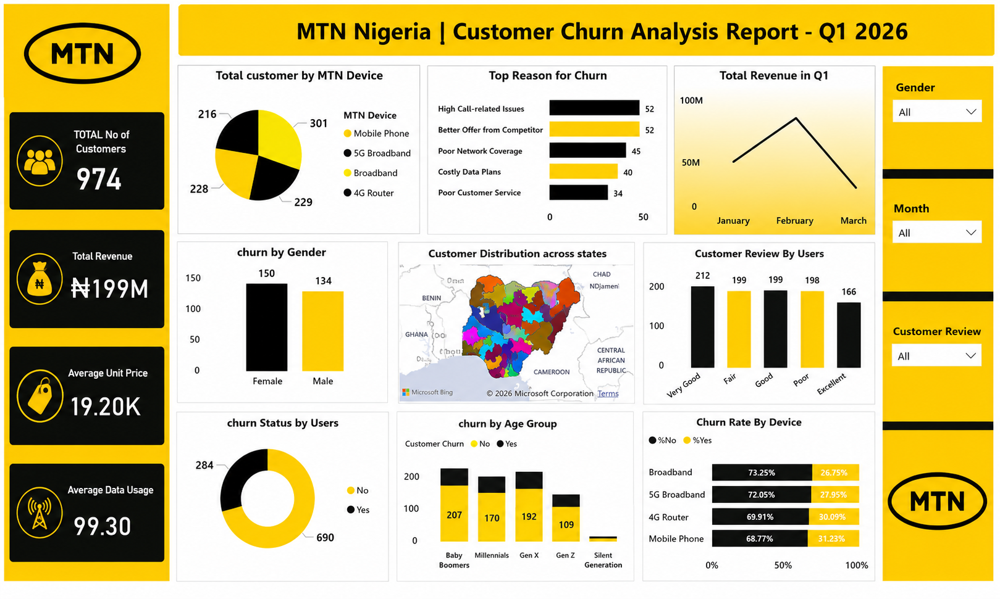

# -MTN-Q1-2026-Churn-Analysis
MTN Nigeria Customer Churn Analysis Dashboard - Q1 2026

## Dashboard Preview

📍Project Overview

This project analyzes customer churn patterns for MTN Nigeria during Q1 2026. The objective was to identify key factors influencing customer attrition, understand customer behavior, and provide insights that can support customer retention strategies.

⚡️Business Problem

Customer churn can significantly impact revenue and business growth. This analysis aims to uncover the main drivers of churn and identify customer segments that are more likely to discontinue services.

🖇️Tools Used

* Microsoft Excel
* Power BI
* Power Query
* DAX (Data Analysis Expressions)

Project Process

1. Data Cleaning and Transformation (ETL)

* Removed duplicate records
* Handled missing values
* Corrected data inconsistencies
* Standardized data formats
* Prepared data for analysis using Power Query

2. Exploratory Data Analysis (EDA)

* Analyzed customer demographics
* Investigated churn patterns across customer groups
* Explored revenue trends and customer feedback

3. Data Modeling & DAX

Created DAX measures and calculations for:

* Total Customers
* Total Revenue
* Average Unit Price
* Average Data Usage
* Churn Metrics
* Customer Distribution Analysis

4. Dashboard Development

Built an interactive Power BI dashboard featuring:

* Customer Churn by Gender
* Churn by Age Group
* Churn Rate by Device
* Revenue Trends
* Customer Satisfaction Reviews
* Geographic Customer Distribution
* Interactive Filters and Slicers

Key Findings

* Total Customers: 974
* Total Revenue: ₦199M
* Female customers recorded slightly higher churn than male customers.
* High call-related issues were the leading cause of customer churn.
* Mobile device users experienced the highest churn rate.
* Revenue peaked in February before declining in March.

Business Recommendations

* Improve network quality and call reliability.
* Develop retention campaigns targeting high-risk customer segments.
* Enhance customer support responsiveness.
* Monitor device-specific churn trends for targeted interventions.

